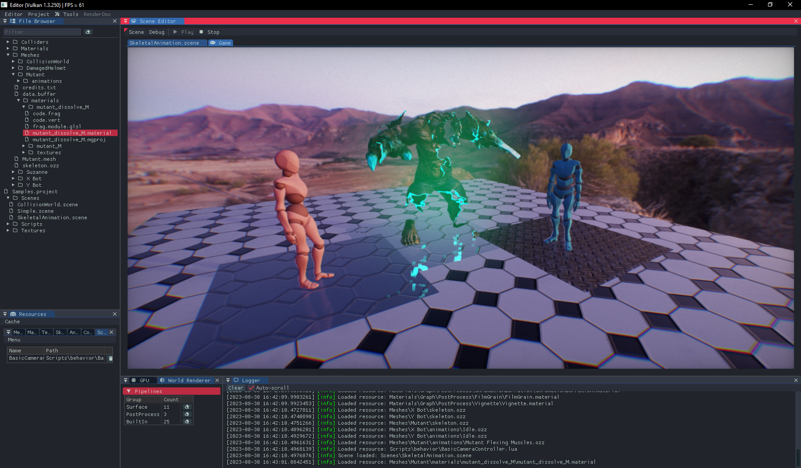
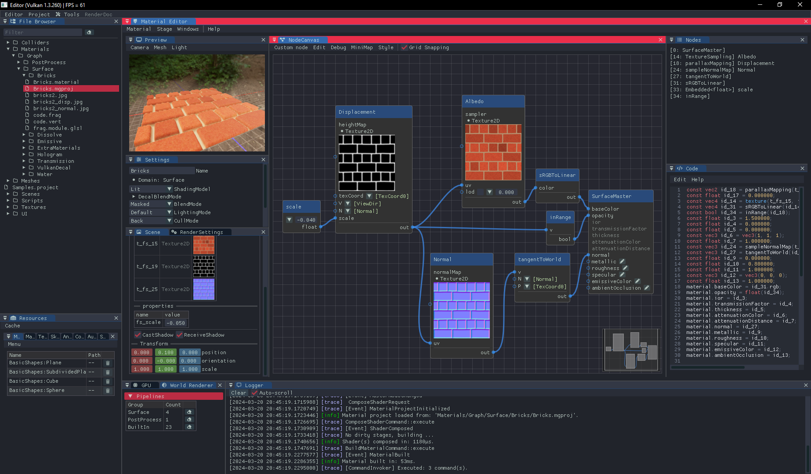
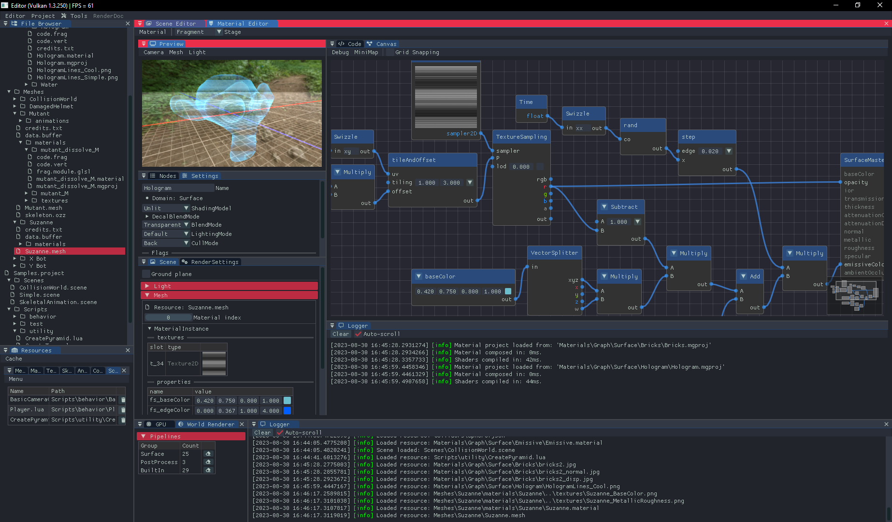
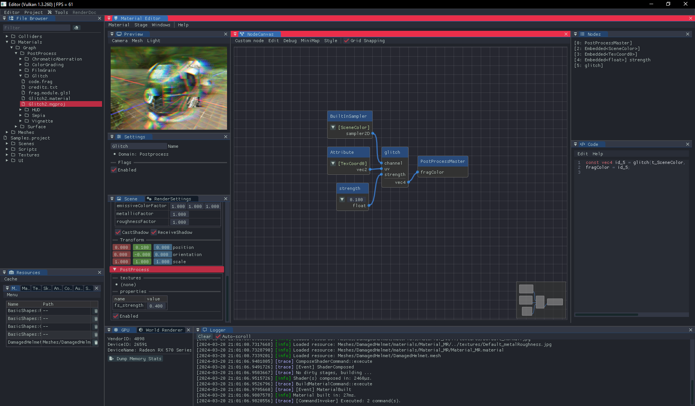
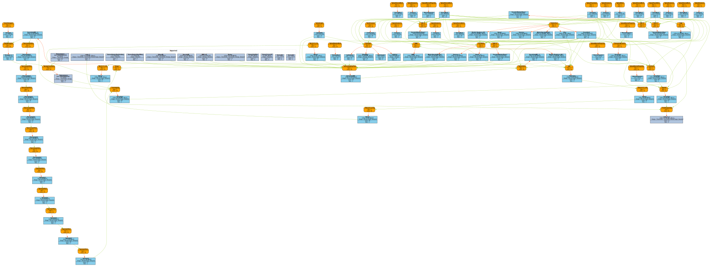

# Supernova Engine

[](https://www.codefactor.io/repository/github/skaarj1989/SupernovaEngine)
[](LICENSE)

An experimental game engine.



<details><summary><b>Screenshots</b></summary>
<p align="center">
    
&nbsp;
    
</p>
<p align="center">
    
&nbsp;
    
</p>

</details>

## Building

```bash
> vcpkg install minizip robin-hood-hashing glm spdlog nlohmann-json cereal glslang spirv-cross ktx[vulkan] stb lua argparse meshoptimizer boost-graph catch2
```

```bash
> git clone --recurse-submodules https://github.com/skaarj1989/SupernovaEngine.git
> cd SupernovaEngine
> cmake -S . -B build
```

## Third-party

- [EnTT](https://github.com/skypjack/entt/wiki)
- [zlib](https://github.com/madler/zlib)
- [robin-hood-hashing](https://github.com/martinus/robin-hood-hashing)
- [glm](https://github.com/g-truc/glm)
- [spdlog](https://github.com/gabime/spdlog)
- [nlohmann-json](https://github.com/nlohmann/json)
- [cereal](https://github.com/USCiLab/cereal)
- [Vulkan SDK](https://vulkan.lunarg.com/sdk/home)
- [glad](https://github.com/Dav1dde/glad)
- [Vulkan Memory Allocator](https://github.com/GPUOpen-LibrariesAndSDKs/VulkanMemoryAllocator)
- [glslang](https://github.com/KhronosGroup/glslang)
- [SPIRV-Cross](https://github.com/KhronosGroup/SPIRV-Cross)
- [FrameGraph](https://github.com/skaarj1989/FrameGraph)
- [KTX-Software](https://github.com/KhronosGroup/KTX-Software)
- [stb_image](https://github.com/nothings/stb)
- [JoltPhysics](https://github.com/jrouwe/JoltPhysics)
- [ozz-animation](https://github.com/guillaumeblanc/ozz-animation)
- [Lua](https://www.lua.org/)
- [sol2](https://github.com/ThePhD/sol2)
- [Tracy Profiler](https://github.com/wolfpld/tracy)
- [RenderDoc](https://renderdoc.org/docs/in_application_api.html)
- [argparse](https://github.com/p-ranav/argparse)
- [assimp](https://github.com/assimp/assimp)
- [meshoptimizer](https://github.com/zeux/meshoptimizer)
- [The Boost Graph Library](https://www.boost.org/doc/libs/1_83_0/libs/graph/doc/index.html)
- [Dear ImGui](https://github.com/ocornut/imgui)
- [imnodes](https://github.com/Nelarius/imnodes)
- [Nuklear](https://github.com/Immediate-Mode-UI/Nuklear)
- [IconFontCppHeaders](https://github.com/juliettef/IconFontCppHeaders)
- [Catch2](https://github.com/catchorg/Catch2)

## Lua annotations for Visual Studio Code

1. Install [Lua Language Server](https://marketplace.visualstudio.com/items?itemName=sumneko.lua)
2. Add path to annotations
    - File -> Preferences -> Settings
    Lua.workspace.library -> Add Item
    - or run: `InstallAnnotations.bat` (requires [yq](https://github.com/mikefarah/yq))

## Acknowledgements

- PBR Lighting based on: [glTF-Sample-Viewer](https://github.com/KhronosGroup/glTF-Sample-Viewer)
- [Forward vs Deferred vs Forward+ Rendering with DirectX 11](https://www.3dgep.com/forward-plus/)
- [OpenGL Cascaded Shadow Maps](https://johanmedestrom.wordpress.com/2016/03/18/opengl-cascaded-shadow-maps/)
- [Automatic Exposure Using a Luminance Histogram](https://bruop.github.io/exposure/)
- [Physically Based Bloom](https://learnopengl.com/Guest-Articles/2022/Phys.-Based-Bloom)

## License

MIT
